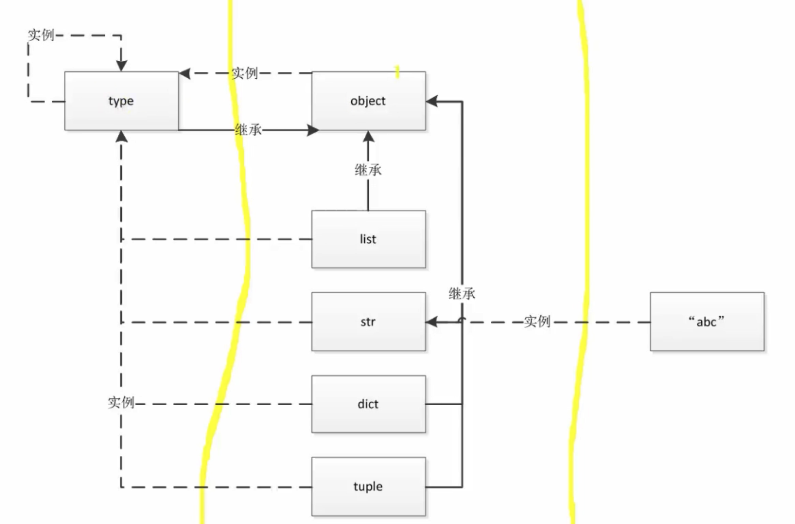

## 一切皆对象

类和函数也是对象：
- 静态语言： class加载到内存中，然后就不能修改了
- 动态语言： 把class赋值给对象，对象是能随便修改的


type、object和class的关系：


```python
# 任何对象都是type的实例
>>> a = "ds"
>>> type(a)
<class 'str'>
>>> type(str)
<class 'type'>

# 任何类的根基类都是object
>>> str.__bases__
(<class 'object'>,)
>>> class Stu:
...     pass
...
>>> Stu.__bases__
(<class 'object'>,)
>>> object.__bases__
()

# type也是继承自object
>>> type.__bases__
(<class 'object'>,)

# object也是type的实例
>>> type(object)
<class 'type'>

# type也是type的实例
>>> type(type)
<class 'type'>

```
python中常见的内置类型(详细请查看xmind)：
- None（全局唯一的，id()相同，表示用的是同一块内存）
- 数值
- 迭代类型
- 序列类型
- 映射（dict）
- 集合
- 上下文管理器with
- python内置类型：
    + package类型
    + class和实例
    + 函数类型
    + 方法类型
    + 代码类型
    + object类型
    + type类型
    + ellipsis类型
    + notimplemented类型


## 魔法函数

```python
class Nums:
    def __init__(self, n):
        self.n = n

    def __abs__(self):
        return abs(self.n + 1)


# nums = Nums(-2)
#
# print(abs(nums))


class V:
    def __init__(self, x, y):
        self.x = x
        self.y = y

    def __add__(self, other):
        return V(self.x + other.x, self.y + other.y)

    def __sub__(self, other):
        return V(self.x - other.x, self.y - other.y)

    def __str__(self):
        return "x:{}, y: {}".format(self.x, self.y)


v1 = V(7, 8)
v2 = V(2, 3)

print(v1 + v2)
print(v2 - v1)
```

```python
class Company:

    def __init__(self, employee):
        self.employee = employee

    def __getitem__(self, item):
        print("item is {}".format(item))
        return self.employee[item]

company = Company(["helios1", "helios2", "helios3"])

for em in company:
    print("em is {}".format(em))
```
