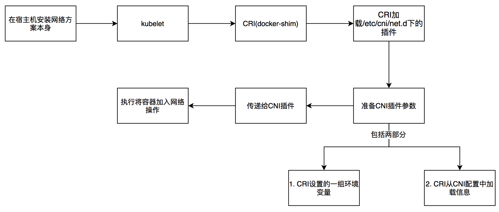

容器网络模型要解决的问题有两个：
1. 为容器分配IP地址
2. 不同容器之间的互通

## 一、docker的网络模型CNM


docker的CNM网络模型中三个部分，分别为：
- sandbox：
    + 容器的网络栈，包括对容器接口、路由表以及DNS配置的管理。
    + 一个sandbox可能包含多个endpoint。
    + 简单来说就是linux的namespace
- endpoint：
    + 一端属于网路一端属于sandbox
    + 简单来说就是veth pair
- network：
    + 一组能够相互通信的endpoint组成
    + 可以通过linux bridge或者vxlan实现

对于跨主机网络来说本质上是实现的一层overlay的网络。这也是swarm网络的实现方式。


图片来自[DEEP DIVE INTO DOCKER OVERLAY NETWORKS : PART 1](https://blog.d2si.io/2017/04/25/deep-dive-into-docker-overlay-networks-part-1/)，我们可以看出有如下特点：
- 容器的sandbox上至少有两个endpoint
- gwbridge是为了访问外部，br0是为了容器间互通
- 为了跨主机通信还有一个全局的KV数据库（这里用的consul）
- 容器间通信是通过vxlan实现的

如果有深入兴趣的可以读读[ Deep dive into docker overlay networks part](https://blog.d2si.io/2017/04/25/deep-dive-into-docker-overlay-networks-part-1/)系列文章，相信会有很大的收获。

我们在下面会讨论CNM和CNI差别。

## 二、CNI的介绍


CNI的全称是Container Network Interface，Google和CoreOS联合定制的网络标准，这个标准基于[rkt](https://github.com/rkt/rkt)实现多容器通信的网络模型。

生产中的网络环境可能是多种多样的，有可能是二层连通的，也有可能是用的公有云的环境，所以各个厂商的网络解决方案百花争鸣，这些解决方案也不能全都集成在kubelet的代码中，所以CNI就是能让各个网络厂商能对接进来的接口。
CNI的[SPEC](https://github.com/containernetworking/cni/blob/master/SPEC.md)兴趣的读者可以看看，下面是CNI规范重要的几点：
- CNI插件负责连接容器
- 容器就是linux network namespace
- CNI的网络定义以json的格式存储
- 有关网络的配置通过STDIN的方式传递给CNI插件，其他的参数通过环境变量的方式传递
- CNI插件是以可执行文件的方式实现的


## 三、CNI原理

CNI的原理主要分为两个部分：
- 二进制插件配置POD的网卡和IP（runtime）：给POD插上网线
- Deamon进程实现网络互通（plugin）： 给POD连上网络


cni的插件可以分为下面三类（这些插件官网已经独立出一个repo，有兴趣可以查看：[containernetworking/plugins](https://github.com/containernetworking/plugins/tree/master/plugins)）：
- Main插件：用来创建具体的网络设备的二进制文件，包括：
    + bridge： 在宿主机上创建网桥然后通过veth pair的方式连接到容器
    + macvlan：从虚拟出多个macvtap，每个macvtap都有不同的mac地址
    + ipvlan：和macvlan相似，也是通过一个主机接口虚拟出多个虚拟网络接口，不同的是ipvlan虚拟出来的是共享MAC地址，ip地址不同
    + loopback： lo设备（将回环接口设置成uo）
    + ptp： Veth Pair设备
    + vlan： 分配vlan设备
    + host-device： 移动宿主上已经存在的设备到容器中
- IPAM(IP Address Management)插件: 负责分配IP地址
    + dhcp： 宿主机上运行的守护进程，代表容器发出DHCP请求
    + host-local： 使用提前分配好的IP地址段来分配
    + static：用于为容器分配静态的IP地址，主要是调试使用
- Meta插件： 由CNI社区维护的内部插件
    + flannel: 专门为Flannel项目提供的插件
    + tuning：通过sysctl调整网络设备参数的二进制文件
    + portmap：通过iptables配置端口映射的二进制文件
    + bandwidth：使用 Token Bucket Filter (TBF)来进行限流的二进制文件
    + firewall：通过iptables或者firewalled添加规则控制容器的进出流量

CNI的思想就是在kubelet启动infra容器后，就可以直接调用CNI插件为这个infra容器的Network Namespace配置符合预期的网络栈。

注：
一个Network Namespace的网络栈包括：网卡（Network interface）、回环设备（Loopback Device）、路由表（Routing Table）和iptables规则。

通过这些插件我们就能看出，如果给kubernetes实现一个容器网络方案，有两部分要做（下面以flannel为例）：
- （创建网络）实现网络方案本身。也就是实现flanneld进程，包括创建和配置flannel.1设备、配置宿主机路由、配置ARP和FDB表里面的信息
- （将容器加入网络）实现该网络方案对应的CNI插件。配置infra容器的网络栈，并把它连接到CNI网桥上


CNI的原理如下图：



- 在宿主机安装网络方案本身：flannel启动后会在每台宿主机上生成它对应的CNI配置文件，来告诉k8s要用flannel作为容器网络方案
```shell
# cat /etc/cni/net.d/10-flannel.conflist
{
  "name": "cbr0",
  "plugins": [
    {
      "type": "flannel",
      "delegate": {
        "hairpinMode": true,
        "isDefaultGateway": true
      }
    },
    {
      "type": "portmap",
      "capabilities": {
        "portMappings": true
      }
    }
  ]
}
```
- kubelet： 网络的处理不是在kubelet的主干代码中，而是在具体的CRI中实现的
- CRI(docker-shim)： docker-shim是kubelet的默认值CRI实现，在kubelet的代码中能找到它
- CRI加载`/etc/cni/net.d`下的插件：目前不支持多个插件混用，但是允许在CNI的配置文件中通过plugins字段，定义多个插件合作
    + 比如在第一步里面的*flannel*和*portmap*分别完成“配置容器网络”和“配置端口映射”的操作
    + docker-shim把CNI配置文件加载之后把将列表中的第一个插件（flannel插件）作为默认插件
- 准备CNI插件参数，包含两部分：
    1. CRI设置的一组环境变量：
        + CNI_COMMAND： ADD/DEL，ADD表示将容器加入网络，DEL则相反（通过veth pair实现）
        + CNI_IFNAME：容器里网卡的名字，比如eth0
        + CNI_NETNS：POD的Network Namespace文件路径
        + CNI_CONTAINERID： 容器ID
        + CNI_PATH： CNI插件的路径
    2. CRI从CNI配置中加载信息（完整配置可参考[ Network Configuration](https://github.com/containernetworking/cni/blob/master/SPEC.md#network-configuration)）：
        + docker-shim会把Network Configuration以json的数据格式，通过STDIN的方式传递给Flannel CNI插件
        + 第一步中flannel插件配置文件中的delegate字段的意思是，CNI插件会调用delegate指定的某个CNI插件来完成（Flannel调用的Delegate插件就是CNI bridge插件）
        + flannel CNI插件就是把dockershim传过来的配置文件进行补充，比如将Delegate的type设置为bridge，将Delegate的IPAM的字段设置为host-local
        + 经过flannel CNI补充之后，完整的Delegate文件如下：
```shell
{
	"hairpinMode":true,
	"ipMasq":false,
	"ipam":{
		"routes":[
			{
				"dst":"10.244.0.0/16"
			}
		],
		"subnet":"10.244.1.0/24",
		"type":"host-local"
	},
	isDefaultGateway":true,
	"isGateway":true,
	"mtu":1410,
	"name":"cbr0",
	"type":"bridge"
}
```

        + ipam字段里面的信息，比如*10.244.0.0/16*读取自Flannel在宿主机上生成的Flannel配置文件（/run/flannel/subnet.env ）
- 传递给CNI插件：经过上述步骤后，得到CNI配置的参数，接下来，Flannel CNI插件就会调用CNI bridhe插件，有了上一步骤的两部分配置（环境变量+Network Configration），CNI brige插件就能代替Flannel CNI插件“执行将容器加入网络操作”
- 执行将容器加入网络操作：
    1. 检查CNI网桥是否存在，如果没有就创建
```shell
# 宿主机
ip link add cni0 type bridg
ip link set cni0 up
```
    2.  CNI bridge插件会通过infra容器的Network Namespace文件进入Network Namespace，创建veth pair设备
```shell
# 在容器里
# 创建一对 Veth Pair 设备。其中一个叫作 eth0，另一个叫作 vethb4963f3
ip link add eth0 type veth peer name vethb4963f3

# 启动 eth0 设备
ip link set eth0 up

# 将 Veth Pair 设备的另一端(也就是 vethb4963f3 设备)放到宿主机(也就是 Host Namespace)里
ip link set vethb4963f3 netns $HOST_NS
# 通过 Host Namespace，启动宿主机上的 vethb4963f3 设备
ip netns exec $HOST_NS ip link set vethb4963f3 up
```
    3. CNI bridge 插件就可以把 vethb4963f3 设备连接在 CNI 网桥上
```shell
# 在宿主机上
ip link set vethb4963f3 master cni0
```
    4. CNI bridge 插件会为cni0网桥设置Hairpin Mode
    5. 调用ipam插件从网段中分配一个ip，把ip添加到容器的eth0网卡同时设置默认路由
```shell
# 在容器里
ip addr add 10.244.0.2/24 dev eth0
ip route add default via 10.244.0.1 dev eth0
```
    6. CNI Bridge插件为CNI网桥添加ip地址
```shell
# 在宿主机上
ip addr add 10.244.0.1/24 dev cni0
```
    7. 所有操作结束之后，CNI插件会把容器的IP等信息返回给dockershim，然后被kubelet添加到POD的status字段


## 四、为什么有CNM还要有CNI呢

|特点|CNM|CNI|
|:--:|:--:|:--:|
|标准规范|[Libnetwork](https://github.com/docker/libnetwork)|[cni](https://github.com/containernetworking/cni)|
|最小单元|容器|POD|
|对守护进程的依赖|依赖dockerd|不依赖任何守护进程|
|跨主通信|要依赖外部KV数据库|用本身的KV的数据库|
|灵活程度|被docker绑架|插件可随意替换|


CNI的设计更加符合kubernetes的容器设计模式，即把一组容器看作一个整体，即POD。当POD启动的时候最先启动的肯定是infra容器，infra容器会创建network namespace，后续创建的容器都是加入这个network namespace。

CNI的设计更加kubernetes的分层架构，具体来说就是遇到问题分一层，大家可能还会想到CRI的设计，PV/PVC。当然这也是架构设计中常用的方案，目的是解决各个模块（组件）之间的耦合。大家可以会想一给CRI的发展过程，以前在kubelet的代码中是有docker-shim和rkt两种容器的实现，每次新增特性还要加两套，如果有了最新的容器运行时（比如kata）那还得加入到kubelet的代码中么？所以就干脆搞一个接口，谁想把不同的容器运行时根据这个接口实现就行了，关于CRI的事情，我们在后面的文章中细谈。

CNI的设计能够提供给不同插件相互组合的，比如在Main插件中，ipvlan和macvlan都能和IPAM中的插件使用。

## 五、如何使用CNI

通过下面的例子会对CNI有一个感性的了解。

把CNI的插件来拉下来
```shell
[root@m7-qatest-k8s128118 opt]# mkdir cni
[root@m7-qatest-k8s128118 opt]# cd cni/
[root@m7-qatest-k8s128118 cni]# curl -O -L https://github.com/containernetworking/cni/releases/download/v0.4.0/cni-amd64-v0.4.0.tgz
[root@m7-qatest-k8s128118 cni]# tar -xzvf cni-amd64-v0.4.0.tgz
[root@m7-qatest-k8s128118 cni]# ll
总用量 70756
-rwxr-xr-x 1 root root  5924584 1月  14 2017 bridge
-rw-r--r-- 1 root root 16066400 3月   2 21:59 cni-amd64-v0.4.0.tgz
-rwxr-xr-x 1 root root  3614840 1月  14 2017 cnitool
-rwxr-xr-x 1 root root 10354296 1月  14 2017 dhcp
-rwxr-xr-x 1 root root  3684624 1月  14 2017 flannel
-rwxr-xr-x 1 root root  4008016 1月  14 2017 host-local
-rwxr-xr-x 1 root root  5308904 1月  14 2017 ipvlan
-rwxr-xr-x 1 root root  5033704 1月  14 2017 loopback
-rwxr-xr-x 1 root root  5334832 1月  14 2017 macvlan
-rwxr-xr-x 1 root root  3400872 1月  14 2017 noop
-rwxr-xr-x 1 root root  5910424 1月  14 2017 ptp
-rwxr-xr-x 1 root root  3791288 1月  14 2017 tuning
```
创建一个namespace：
```shell
[root@m7-qatest-k8s128118 cni]# ip netns add 1234567890
```


新增CNI的配置文件：
```shell
cat > mybridge.conf <<"EOF"
{
    "cniVersion": "0.2.0",
    "name": "mybridge",
    "type": "bridge",
    "bridge": "cni_bridge0",
    "isGateway": true,
    "ipMasq": true,
    "hairpinMode":true,
    "ipam": {
        "type": "host-local",
        "subnet": "10.15.20.0/24",
        "routes": [
            { "dst": "0.0.0.0/0" },
            { "dst": "1.1.1.1/32", "gw":"10.15.20.1"}
        ]
    }
}
EOF
```
其中：
- cniVersion： CNI规范的版本
- name： 这个网络的名字叫mybridge
- type：使用brige插件
- isGateway：如果是true，为网桥分配ip地址，以便连接到它的容器可以将其作为网关
- ipMasq：在插件支持的情况的，设置ip伪装。当宿主机充当的网关无法路由到分配给容器的IP子网的网关的时候，这个参数是必须有的。
- ipam：
    + type：IPAM可执行文件的名字
    + 要分配给容器的子网
    + routes
        + dst： 目的子网
        + gw：到达目的地址的下一跳ip地址，如果不指定则为默认网关
- hairpinMode: 让网络设备能够让数据包从一个端口发进来一个端口发出去
更多配置信息请参考：[Network Configuration](https://github.com/containernetworking/cni/blob/master/SPEC.md#network-configuration)

将刚才新建的1234567890的namespace加入到network上
```shell
[root@m7-qatest-k8s128118 cni]# CNI_COMMAND=ADD CNI_CONTAINERID=1234567890 CNI_NETNS=/var/run/netns/1234567890 CNI_IFNAME=eth12 CNI_PATH=`pwd` ./bridge < mybridge.conf
2020/03/02 22:14:57 Error retriving last reserved ip: Failed to retrieve last reserved ip: open /var/lib/cni/networks/mybridge/last_reserved_ip: no such file or directory
{
    "ip4": {
        "ip": "10.15.20.2/24",
        "gateway": "10.15.20.1",
        "routes": [
            {
                "dst": "0.0.0.0/0"
            },
            {
                "dst": "1.1.1.1/32",
                "gw": "10.15.20.1"
            }
        ]
    },
    "dns": {}
}
```
查看新建的namespace的网络配置
```shell
[root@m7-qatest-k8s128118 cni]# ip netns exec 1234567890  ip a
1: lo: <LOOPBACK> mtu 65536 qdisc noop state DOWN group default qlen 1
    link/loopback 00:00:00:00:00:00 brd 00:00:00:00:00:00
3: eth12@if1137099: <BROADCAST,MULTICAST,UP,LOWER_UP> mtu 1500 qdisc noqueue state UP group default
    link/ether 0a:58:0a:0f:14:02 brd ff:ff:ff:ff:ff:ff link-netnsid 0
    inet 10.15.20.2/24 scope global eth12
       valid_lft forever preferred_lft forever
    inet6 fe80::34da:9fff:febe:f332/64 scope link
       valid_lft forever preferred_lft forever
[root@m7-qatest-k8s128118 cni]# ip netns exec 1234567890 route -n
Kernel IP routing table
Destination     Gateway         Genmask         Flags Metric Ref    Use Iface
0.0.0.0         10.15.20.1      0.0.0.0         UG    0      0        0 eth12
1.1.1.1         10.15.20.1      255.255.255.255 UGH   0      0        0 eth12
10.15.20.0      0.0.0.0         255.255.255.0   U     0      0        0 eth12
[root@m7-qatest-k8s128118 cni]# ip netns exec 1234567890 ifconfig
eth12: flags=4163<UP,BROADCAST,RUNNING,MULTICAST>  mtu 1500
        inet 10.15.20.2  netmask 255.255.255.0  broadcast 0.0.0.0
        inet6 fe80::34da:9fff:febe:f332  prefixlen 64  scopeid 0x20<link>
        ether 0a:58:0a:0f:14:02  txqueuelen 0  (Ethernet)
        RX packets 0  bytes 0 (0.0 B)
        RX errors 0  dropped 0  overruns 0  frame 0
        TX packets 9  bytes 738 (738.0 B)
        TX errors 0  dropped 0 overruns 0  carrier 0  collisions 0
```

- http://www.dasblinkenlichten.com/understanding-cni-container-networking-interface/
- http://www.dasblinkenlichten.com/using-cni-docker/

## 六、不同CNI插件的选择


## 七、总结

- 搞清楚CNM和CNI的区别
    + CNM：https://github.com/docker/libnetwork/blob/master/docs/design.md
    + CNI：https://github.com/containernetworking/cni/blob/master/CONVENTIONS.md
    + https://kccncna19.sched.com/event/Uaif/introduction-to-cni-the-container-network-interface-project-bryan-boreham-weaveworks-dan-williams-red-hat

- https://cizixs.com/2017/05/23/container-network-cni/
- https://yucs.github.io/2017/12/06/2017-12-6-CNI/
- https://www.cnblogs.com/YaoDD/p/7419383.html
- https://www.cnblogs.com/YaoDD/p/7405725.htm


## 参考
- [浅聊几种主流 Docker 网络的实现原理](https://www.infoq.cn/article/9vfPPfZPrXLM4ssLlxSR)
- https://www.jianshu.com/p/3b9389084701
- 极客时间《深入剖析kubernetes》
