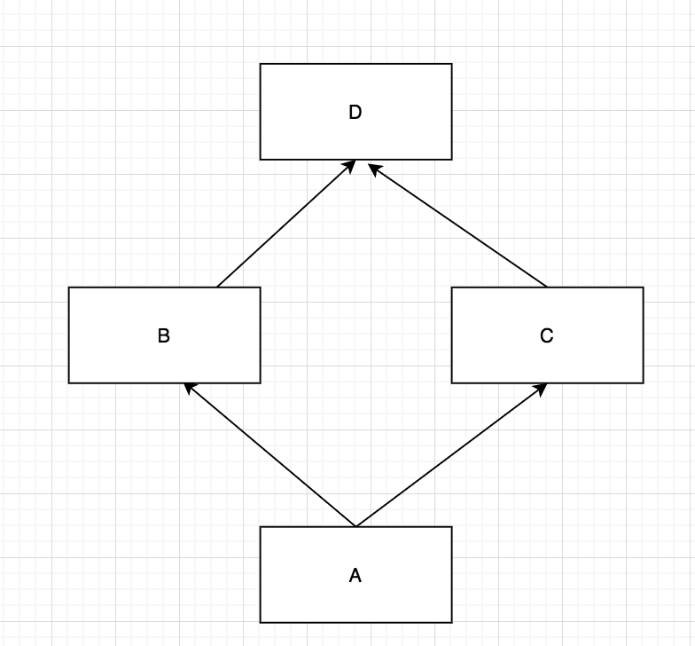

-----
[文章首发](https://github.com/helios741/myblog/tree/new/learn_go/src/2020/0315_python_class)
-----
如果您觉得有什么不理解，或者觉得文章有欠缺的地方，请您点击[这里](https://github.com/helios741/myblog/issues/78)提出。我会很感谢您的建议也会解答您的问题。

# 深入理解python中类和对象

## 零、你要知道的：静态语言和动态语言在类上的差别

我们都知道了在python中一切皆对象，类也是对象。

首先我们要先明白一下什么是鸭子类型，根据[维基百科](https://zh.wikipedia.org/wiki/%E9%B8%AD%E5%AD%90%E7%B1%BB%E5%9E%8B)中定义“当看到一只鸟走起来像鸭子、游泳起来像鸭子、叫起来也像鸭子，那么这只鸟就可以被称为鸭子”。

这句话的含义是，某些动态语言的对象不用和静态语言（比如java）要继承特定的类或者实现指定的接口，而是只是关注其对象本身的行为。

所以当我们定义接受一个“鸭子类型”的变量的时候，只管调用它里面有的方法或者属性就行了，不用关注他继承自什么，实现了什么。

静态类型，比如说java语言，它定义的类就比较严格，当定义一个接受某个类型的函数的时候，如果这个变量是对象类型，就必须要保证这个对象实现了某个接口。这样带来的好处就是，在写代码阶段就解决一部分潜在的错误，也可以自动生成很好的文档。

相比于静态语言，动态语言如果出现传递的参数有错误的话，只能在运行阶段产生，当然动态语言也可以实现静态语言那样的静态类型检查（注意这里不是说的强类型和弱类型哟），比如现在风头正火的Typescript就实现了javascript版本的静态类型检查。

## 一、面向对象套路：封装、继承、多态说起

### 1.1 多态

python中的多态可以说再简单不过了，反正声明类型也不会指定变量类型，可以粗暴的理解为变量都是多态的。

### 1.2 继承
```python
class Base1:
    name = "helios1"

class Base2:
    name = "helios2"

class Child(Base2, Base1):
    age = "12"
    def __init__(self, sex):
        self.sex = "man"

if __name__ == "__main__":
    c = Child("man")
    print("name :{}, age: {}, sex: {}".format(c.name, c.age, c.sex))
```
输出：
在python中是支持多继承的，如果多个父类有相同的属性或者方法就以前面的为准（非多重继承），具体的实例属性的查找过程后面会详细说
```shell
name :helios2, age: 12, sex: man
```

如果子类想要调用父类的方法，可以使用super函数。
```python
class Base:
    def __init__(self, name):
        # 对name进行一些加工
        self.name = name
class Child(Base):
    def __init__(self, sex, name):
        self.sex = sex
        super().__init__(name)
        # super(Child, self).__init__(name)
if __name__ == "__main__":
    c = Child("man", "helios")
    print("name :{}, sex: {}".format(c.name, c.sex))
```


### 1.3 封装
python中没有protected的属性，但是可以通过在属性前面加上双下划线(__)的为其设置私有成员，如下：
```python
class User:
    def __init__(self):
        self.name = "helios"
        self.__age = "22"

if __name__ == "__main__":
    u = User()
    print(u.name)
    # print(u.__age) # AttributeError: 'User' object has no attribute '__age'
```
当然就像java可以通过反射能拿到私有成员一样，在python中更容易拿到一些，通过_Class__attr也是能拿到的，比如下面：
```python
class User:
    def __init__(self):
        self.name = "helios"
        self.__age = "22"

if __name__ == "__main__":
    u = User()
    print(u.name)
    print(u._User__age)
```

## 二、 关于类和实例：属性和方法

### 2.1 多重继承中属性的查找顺序

上一节我们已经介绍了继承，但是还留个一个悬念，就是在多重继承中属性的查找的过程。
我们先看下面这种典型的多重继承：

```python
class E:
    pass
class D:
    pass
class B(D):
    pass
class C(E):
    pass
class A(B, C):
    pass

if __name__ == "__main__":
    print(A.mro())
    print(A.__mro__)
```
输出结果为：
```shell
[<class '__main__.A'>, <class '__main__.B'>, <class '__main__.D'>, <class '__main__.C'>, <class '__main__.E'>, <class 'object'>]
(<class '__main__.A'>, <class '__main__.B'>, <class '__main__.D'>, <class '__main__.C'>, <class '__main__.E'>, <class 'object'>)
```
我们可以看到属性的查找顺序为A -> B -> D -> C -> E

然后看一下菱形继承：

```python
class D:
    pass
class B(D):
    pass
class C(D):
    pass
class A(B, C):
    pass

if __name__ == "__main__":
    print(A.mro())
    print(A.__mro__)
```
输出结果为：
```shell
[<class '__main__.A'>, <class '__main__.B'>, <class '__main__.C'>, <class '__main__.D'>, <class 'object'>]
(<class '__main__.A'>, <class '__main__.B'>, <class '__main__.C'>, <class '__main__.D'>, <class 'object'>)
```
我们可以看到属性的查找顺序为A -> B -> C-> D 

MRO(Method Resolution Order)是返回在类的层次上查找属性的顺序，在python3中是使用C3算法实现的。

### 2.2 静态方法、类方法和对象方法

直接来看一个例子：
```python
class Date:
    def __init__(self, y, m, d):
        self.y = y
        self.m = m
        self.d = d

    def next_day(self, n):
        # 省略关于日期的处理
        return self.d + n

    @classmethod
    def parse_str_to_date(cls, str):
        y, m, d = tuple(str.split("-"))
        return cls(int(y), int(m), int(d))

    @staticmethod
    def valid_day(d):
        if d > 31:
            return False
        return True

if __name__ == "__main__":
    d = Date(2020, 2, 29)
    print("y:{}, m:{},d:{}".format(d.y, d.m, d.d))
    print(d.parse_str_to_date("2020-03-01"))
    print(Date.parse_str_to_date("2020-03-01"))
    print(d.valid_day(12))
    print(Date.valid_day(12))
```
- 实例方法：next_day，只有把对应的类实例化之后才能使用，能使用对应的self上的属性
- 类方法：parse_str_to_date，既能通过实例化类的对象调用也能直接通过类调用，第一参数(cls)代表这个类，能解决硬编码的问题(通过cls代替Date)
- 静态方法：valid_day，主要用在把类当作一个命令空间，不依赖类，其实拿出去搞个函数也行，这样做主要是为了聚合，Date类能做更多和日期相关的东西


### 2.3 计算属性

```python
class User:
    def __init__(self):
        self._name = None

    @property
    def name(self):
        # 可以有一系列操作
        return self._name

    @name.setter
    def name(self, v):
        self._name = v + "xxxx"

if __name__ == "__main__":
    u = User()
    print(u.name)
    u.name = "helios"
    print(u.name)
```
通过在类中的函数加个@property装饰器，当我们使用这个变量name的时候就会返回里面对应内容，一般里面的内容是通过self上其他属性转变来的，所以叫计算属性

当我们通过@name.setter(即@变量名.setter)的方式就是定义设置变量name时候的操作，当然这里面也能执行许多逻辑。


## 三、 数据描述符：关于属性的查找过程

### 3.1 什么是属性描述符

python描述符是为了更好的代替2.3节的计算属性，试想一下如果我们有很多属性要定义为计算属性，那代码写起来岂不是灾难。

python的属性描述符是一种协议，包含下面几种方法：
- __get__
- __set__
- __delete__

如果一个对象同时定义了__get__和__set__，那么该对象被称为data descriptor；如果只实现了__get__那么被称为 non-data descriptors。
如果一个对象（通常是类）定了上述的任何一个方法，便实现了描述符协议。看下面的例子
```python
class IntField:
    def __init__(self):
        self.value = None

    def __get__(self, instance, owner):
        return self.value
    def __set__(self, instance, value):
        if not isinstance(value, numbers.Integral):
            raise ValueError("must int")
        if value < 0:
            raise ValueError(" must >= 0")
        self.value = value

class User:
    age = IntField()

if __name__ == "__main__":
    u = User()
    # u.age = "12" ValueError: must int
    u.age = 23
    print(u.age)
```
输出为：
```shell
23
```
上述代码中IntField就是一个属性描述符对象，
- 当我们读age这个变量的时候就是调用IntField中的__get__魔法函数
- 当我们对age这个变量进行赋值的时候会调用IntField中的__set__魔法函数

我们还可以定义string的描述符类，Float的描述符类，这样就更加原子性的出来，在对应的描述符中还能增加校验等操作。

### 3.2 __getattr__和__getattribute__

- __getattr__当实例访问没有的属性的时候就会触发这个魔法函数
- __getattribute__当实例访问任何属性的时候都会触发这个函数
```python
class User:
    def __init__(self, name, info={}):
        self.name = name
        self.info = info

    def __getattr__(self, item):
        return self.info[item]

    # def __getattribute__(self, item):
    #     return "dsd"
if __name__ == "__main__":
    info = {
        "name": "helios",
        "age": 12
    }
    u = User("dajiahoa", info)
    print(u.name, u.age)

```
输出为：
```shell
dajiahoa 12
```

*__getattribute__*这个还是尽量少用， 比较危险。
### 3.3 属性的查找过程

我们来根据这个例子说：
```python
import numbers

class IntField:
    def __init__(self):
        self.value = None

    def __get__(self, instance, owner):
        return self.value
    def __set__(self, instance, value):
        if not isinstance(value, numbers.Integral):
            raise ValueError("must int")
        if value < 0:
            raise ValueError(" must >= 0")
        self.value = value

class NonDataIntField:
    def __get__(self, instance, owner):
        return None

class User:
    age = IntField()
    name = NonDataIntField()

if __name__ == "__main__":
    u = User()
    u.age = 23
    print(u.age)
```
u是User的实例，那么在调用u.age的时候：
1. 调用__getattribute__
    + 抛AttributeError错误，继续调用__getattr__
    + 不抛错，直接返回
2. age出现在User或者基类的的__dict__中，且age是属性描述符，那么调用其__get__方法
3. age存在于u.__dict__上，直接返回u.__dict__["age"]
4. 如果age出现在User或其基类的__dict__中
    + age是 non-data descriptors，调用__get__
    + 返回 __dict__[‘age’]
5. 如果User有__getattr__方法，调用__getattr__方法
6. 抛出AttributeError


## 四、 类继承实践：抽象基类和mixin

### 4.1 抽象基类

python中可以通过abc模块定义抽象类。
```python
import abc
class ABSBase(metaclass=abc.ABCMeta):
    @abc.abstractmethod
    def get(cls):
        pass

    @abc.abstractmethod
    def set(self):
        pass

class ABSChild(ABSBase):

    def get(self):
        pass
    def set(self):
        pass

if __name__ == "__main__":
    a = ABSChild()
```

### 4.2 mixin

mixin是将多个类中的功能单元进行组合的方式进行利用。

```python
class LogMxin():

    def log(self):
        print("log mixin load")

class ShowMixin():
    def show(self):
        print("show mixin show")

class User(LogMxin, ShowMixin):

    def msg(self):
        self.show()
        self.log()

if __name__ == "__main__":
    u = User()
    u.msg()
```

mixin并不是新的技术而是一种设计方法，能够更好的利用python的多继承。这种设计原则就是*mixin的设计最好原子化，小且精*。


## 总结

本文主要定位是在初级之上高级之下。
第一部分（零、一、二节）解释了python中的类和静态语言（如java）中类的差别以及细致讲解了类和对象。
第二部分(三节)属于进阶篇章讲解了关于属性描述符的，python属性描述符在属性查找过程中的影响
最后一部分（第四节）讲解了类的基础实践，关于抽象类和mixin的使用


如果您觉得有什么不理解，或者觉得文章有欠缺的地方，请您点击[这里](https://github.com/helios741/myblog/issues/78)提出。我会很感谢您的建议也会解答您的问题。


## 参考
- [python __new__文档](https://docs.python.org/3/reference/datamodel.html?highlight=__new__#object.__new__)
- [Python 系列学习十六：descriptor 官文解读](https://www.shangyang.me/2017/07/17/python-syntax-9-descriptor-01-official/)
